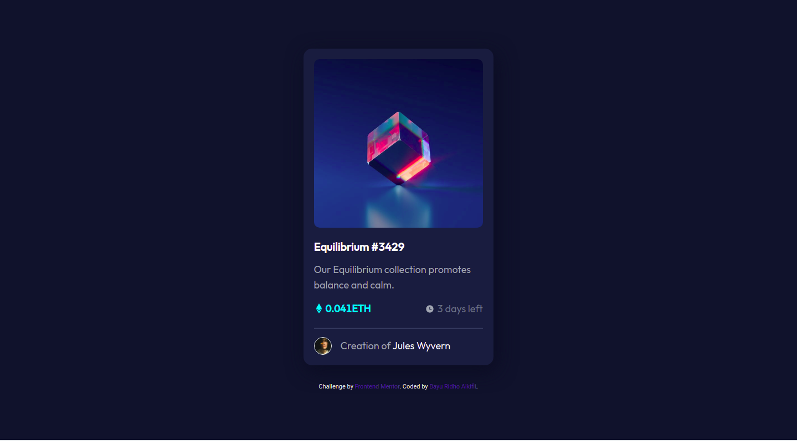
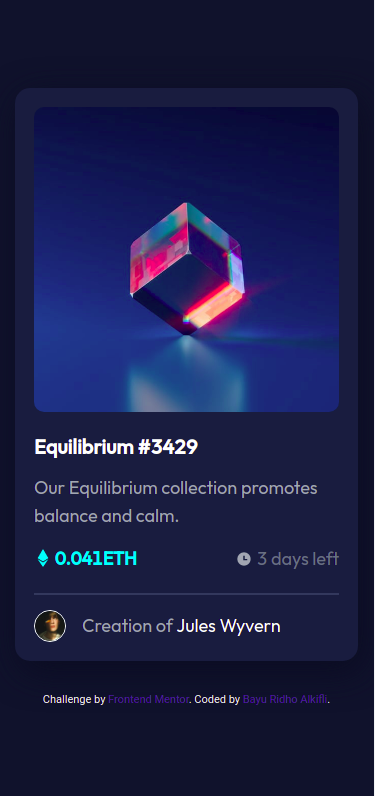

# Frontend Mentor - NFT preview card component solution

This is a solution to the [NFT preview card component challenge on Frontend Mentor](https://www.frontendmentor.io/challenges/nft-preview-card-component-SbdUL_w0U). Frontend Mentor challenges help you improve your coding skills by building realistic projects.

## Table of contents

- [Overview](#overview)
  - [The challenge](#the-challenge)
  - [Screenshot](#screenshot)
  - [Links](#links)
- [My process](#my-process)
  - [Built with](#built-with)
  - [What I learned](#what-i-learned)
  - [Continued development](#continued-development)
  - [Useful resources](#useful-resources)
- [Author](#author)
- [Acknowledgments](#acknowledgments)

## Overview

### The challenge

Users should be able to:

- View the optimal layout depending on their device's screen size
- See hover states for interactive elements

### Screenshot




### Links

- Solution URL: [Github Repo](https://github.com/BayuRidhoAlkhifli/nft-preview-card-component-main)
- Live Site URL: [Live Site](https://bayuridhoalkhifli.github.io/nft-preview-card-component-main/)

## My process

### Built with

- CSS custom properties
- Flexbox
- Mobile-first workflow
- [React](https://reactjs.org/) - JS library
- [Styled Components](https://ant.design/) - For Styling

### What I learned

After I submitted my solution on frontendmentor.io I got several errors and warnings including:

-It's better to use the h1 heading first, before using any other child headings.

```html
//before
<Typography.Title level="{4}" className="link">
  Equilibrium #3429
</Typography.Title>

//after
<Typography.Title level="{1}" className="link">
  Equilibrium #3429
</Typography.Title>
```

-Div tags cannot be used for strong and span tags

```html
//before
  <Col>
    //Typography.Text antd using tags span to create Text Component
    <Typography.Text strong className='align-items-center color-cyan'>
      <FaEthereum style={{ marginBottom: 2, marginRight: 3 }} /> 0.041ETH
    </Typography.Text>
  </Col>

//after
  <Col className='align-items-center color-cyan'>
    <FaEthereum style={{ marginBottom: 2, marginRight: 3 }} />
    <Typography.Text strong className='color-cyan'>
      0.041ETH
    </Typography.Text>
  </Col>
```

### Continued development

This was a simple component project from Front-End Mentor, so I think it's just for some practice and to have some fun. So, I'll leave it with no further changes.

### Useful resources

- [Ant Design](https://ant.design/) - This website helped me to install and build card components to complete this challenge.
- [Developer Mozilla](https://developer.mozilla.org/en-US/docs/Web/HTML/Element/Heading_Elements) - This is an excellent article that finally helped me understand how to use Headings properly. This site not only explains the Heading, there are several other articles explaining web technology that I can study. I recommend it to anyone who wants to learn web applications.

## Author

- Website - [Sibayu.id](https://sibayu.id/)
- Frontend Mentor - [@BayuRidhoAlkhifli](https://www.frontendmentor.io/profile/BayuRidhoAlkhifli)
- Github - [BayuRidhoAlkhifli](https://github.com/BayuRidhoAlkhifli)

## Acknowledgments

Thanks to Front-End Mentor for this project and for providing me with beautiful design files to make this project.
